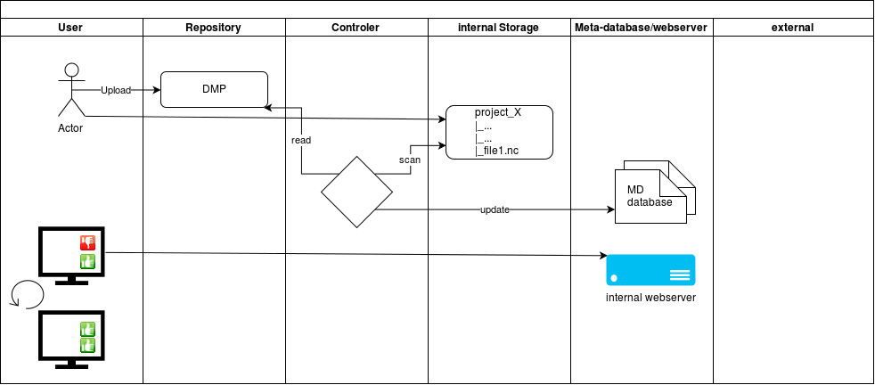
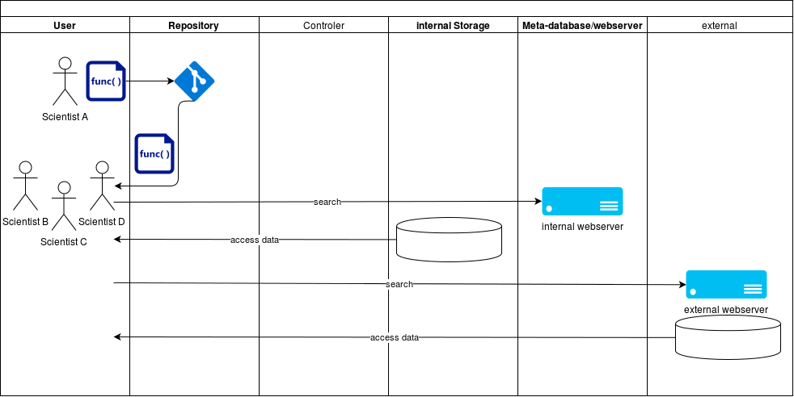

Konzept für Neuorganisation der Datenhaltung am Institut für Physik der Atmosphäre
===================================================================================

Björn Brötz | Winfried Beer

## Ziele der neuen Struktur

+ Nachnutzbarkeit der Forschungsdaten innerhalb des Institutes verbessern
+ Datenspeicherung besser gegen Datenverlust schützen
+ Geordnete Datenpublikation ermöglichen

## Bedarf

Während dem zweiten Treffen des IPA Arbeitskreis zu Forschungsdaten (AK-Daten) im Mai 2018 wurde der Bedarf der Mitarbeiter von den Abteilungsvertretern mitgeteilt. Im Gesamten stellt er sich wie folgt dar:

+ Datenhaltung
    - Institutslösung für kleinere bis mittlere Daten von Wissenschaftlern gewünscht
    - Kosten-Nutzen bei Speicherung berücksichtigen
    - Speicherung von großen Datenmengen extern (z.B DKRZ)
+ Software
    - Software, die bei Datenerzeugung und Datenaufbereitung, etc. entsteht soll in gemeinsamen Repository Dienst verwaltet werden
    - Software und Daten gemeinsam verfügbar halten
+ Zugriffsrechte
    - Getrennte Handhabung von interner und externer Nutzung
    - Zugriffsrechte müssen kontrolliert werden können
+ Metadaten
    - Verwendbarkeit der Daten unabhängig vom Erzeuger
    - Kontext, in dem die Messdaten gewonnen wurden, als Metadaten mit speichern
    - Konzept für Laborbücher und Handschriftliche Notizen als "Metadaten"
+ Policies 
    - Kommunikation der Richtlinien
    - Lizenzen für Daten 
    - Aufbewahrungszeit für welche Daten
    - Datenmanagementpläne nach definiertem Standard

## Umsetzung 

Aufgrund der hohen Unsicherheit über die exakten Anforderungen der Nutzer und wie genau die äußeren Faktoren bedingt durch Geldgeber, Jounals etc. sich darstellen wird die Planung und Umsetzung des System nach **Agilen Methodiken** erfolgen. Dies erlaubt eine flexible Anpassung des Systemdesigns während der Implementation, sowie den Aufbau von Expertise. Das hier beschriebene System ist nicht als fest definiert zu betrachten, sondern als erste allgemeine Abschätzung. In der Umsetzung wird zunächst ein *minimum viable product* (MVP) implementiert, also das gesamte System wird mit minimalem Ressourcen-Einsatz in grundlegender Funktionalität vollständig umgesetzt. Testuser beginnen das rudimentäre System zu nutzen und geben ihr Feedback/Änderungswünsche kontinuierlich an die Verantwortlichen zurück. Diese bewerten und priorisieren das User-Feedback und bauen das System basierend hierauf weiter aus. Während dieses Zyklus werden gewisse Kenngrößen (Rate der Forschungsdaten mit/ohne Metadaten, Systemauslastung, etc.) erhoben um den Erfolg des Systems zu überwachen (Agiles Prinzip: *build-measure-learn*). Ab einem gewissen Grad an Reife wird das System dann allen im Institut freigegeben. Die kontinuierliche Anpassung erfolgt weiterhin.  

## Strukturentwurf für Neuorganisation

In Abbildung 1 ist die neue Struktur schematisch dargestellt. Im Zentrum des Systems steht ein Instituts-interner zentraler Datenserver, bestehend aus einem Datenspeicher, einer Metadatenbank und einem internen Webserver. Die wissenschaftlichen Nutzer des Systems haben Zugriff zu diesem Speicher in gewohnter Weise (als gemountetes Filesystem unter Linux, oder als Netzlaufwerk unter Windows). 

Im Unterschied zur bisherigen Praxis existiert in diesem Entwurf eine institutsweit geltende Richtlinie (siehe unten) und Anforderungen, die in spezifischen Datenmanagementplänen formuliert sind. Die so formulierten Regeln schreiben die Details der Datenablage vor. Die Datensätze werden hiernach automatisiert geprüft und die Ergebnisse der Überprüfungen werden, zusammen mit weiteren Metadaten, in einer Metadatenbank gespeichert. Diese Informationen sind über einen internen Webserver institutsöffentlich einsehbar, sodass die formale Qualität der abgelegten Daten sowie ihre Konformität zu den definierten Regeln transparent kommuniziert wird.

Sowohl für die Datenmanagement-Pläne als auch für die spezifische Software des System wird ein institutsöffentliches *Repository* mit Versionskontrolle eingerichtet. Dort kann auch von Nutzern entwickelte Software, die in Zusammenhang mit der Datenauswertung und Datenablage steht, verwaltet werden. 

Um die Daten nach außen freizugeben wird ein getrennter *Publikationsserver* eingerichtet. Dieser besteht ebenfalls aus einem Datenspeicher, einer Metadatenbank und einem Webserver um den Zugriff zu regeln. Alternativ oder parallel hierzu können auch externe Dienste genutzt werden, die von Kooperationspartnern (z.B. DKRZ) oder kommerziellen Unternehmen angeboten werden (z.B. Zenodo, wissenschaftliche Verlagen, etc.).

Daten zu langzeitarchivieren ist im Rahmen einer instituts-Lösung nur sehr eingeschränkt möglich. Um eine zufriedenstellende Langzeitarchivierung von Daten zu erreichen sind wir auf Kooperation mit Partnern angewiesen (z.B. DFD oder DKRZ).

 
Um den Mitarbeitern die optimale Nutzung des Systems zu ermöglichen muss parallel zum Aufbau eine nutzerorientierte Dokumentation mitgeführt werden. Ferner sollten Schulungen der Mitarbeiter zu folgenden Themen erfolgen:

+ wissenschaftliche Datenformate am IPA
+ Erstellung von Datenmanagementplänen
+ Versionkontrolle (Daten und Software)
+ Publikation von Daten (Lizenzen)

## Standards und Datenmanagementpläne

Entsprechend der "Grundlagen zu Forschungsdaten" (Graf et al., 2018) sollen die einzelnen Institute des DLR institutsspezifische Richtlinien für Forschungsdaten erlassen.

Im Bezug auf das neue System soll in der IPA-Forschungsdatenrichtlinie folgendes geregelt werden:

+ Datenformate
+ Definition eines Satzes von notwendigen Metadaten
+ Datenmanagementplan

### Datenformate

Nach Umfrage im Institut wird eine Auswahl von Datenformaten definiert, die vom System unterstützt werden sollen. Diese Datenformate sollen nicht proprietär sein und sollen ermöglichen Metadaten zu speichern, z.B. NetCDF, standardisierte Text-files mit Metadatenbereich. Sollte die Nutzung nicht-proprietärer Formate nicht möglich sein wird im Einzelfall darauf eingegangen und eine Lösung erarbeitet.    

### Metadaten

Es wird der vollständige Satz an Metadaten für einen Forschungsdatensatz benötigt, der für die Nachnutzung dieses Datensatzes in der Zukunft notwendig ist. Welche Metadaten dies sind wird im Datenmanagementplan definiert. Darüberhinaus liegt es im Ermessen des Datenerzeugers weitere Metadaten hinzuzufügen. Ein Basissatz an Metadaten wird von der Institutsrichtlinie vorgeschrieben.

### Datenmanagenemt-Plan

Ein Datenmanagementplan (DMP) enthält unter anderem:

+ Wichtung der einzelnen Datensätze unter Betrachtung der Kosten-Nutzen-Relation
+ Definition der zur Nachnutzung notwendigen Metadaten
+ Definition des Lebenszykluses der Daten (Archivierung)
+ Definition der Lizenz unter der die Daten freigegeben werden
  
Die Verwaltung der anfallenden DMPs erfolgt im IPA-"software repository". Die jeweils für den Datensatz geltenden DMPs werden in den Metadaten referenziert. Es wird ein IPA-Standard DMP zur Verfügung gestellt, der für die konkrete Situation angepasst werden kann.

Um vom System genutzt werden zukönnen muss der Teil der Datenmanagementpläne, der die obengenannten Punkte enthält, maschinenlesbar abgelegt sein. Näheres definiert die Institutsrichtlinie.

## Workflows

Ausgehend von folgenden *user stories* wurden workflows für das neue System abgeleitet:

### *"Als wissenschaftlicher Nutzer möchte ich Daten intern ablegen"*

Der wissenschaftliche Nutzer lädt in einem ersten Schritt einen Datenmanagementplan in das repository. Dann legt er seine Daten in Form von Dateien an einer Stelle im internen Speicher ab, für das er Schreibrechte besitzt. Ein automatisierter Prozess überprüft nun die abgelegten Daten und prüft die gefundenen Metadaten gegen die Angaben im allgemeinen DMP und, sofern in den Metadaten referenziert, auch gegen den vom Nutzer hochgeladenen spezifischen DMP. Das Ergebnis der Überprüfung wird in die Metadatenbank des Systems geschrieben. Auch Dateien, die völlig ohne Metadaten abgelegt wurden werden hier vermerkt. Der Nutzer kann nun über seinen Browser die Webseite des Systems aufrufen und die Prüfergebnisse seiner abgelegten Dateien einsehen. Der Nutzer kann dann in einem iterativen Prozess die formale Qualität der Daten verbessern.

### *"Als wissenschaftlicher Nutzer möchte ich Daten veröffentlichen"*
Der Publikation nach außen ist der vorangegangene Workflow der Datenablage vorgelagert. Wenn der Datensatz den formalen Qualitätsansprüchen der DMPs entspricht, kann der wissenschaftliche Nutzer eine Anfrage zur Publikation über die Webseite an das System stellen. Der Operator des System bekommt dann eine Mitteilung und stößt nach Freigabe einen automatisierten Prozess an, der 

+ die betroffen Dateien zu einem Archiv zusammenfasst
+ die relevanten Metadaten aus dem System liest
+ die Vorbereitungen für eine DOI Vergabe für diesen Datensatz trifft
+ die Archivdatei auf den externen Datenserver schiebt und die externe Datenbank/Webserver mit den gesammelten Metadaten aktualisiert
+ Die endgültige DOI-Aktivierung sollte manuell vom Operator erfolgen 

### *"Als Entscheidungsträger möchte ich den Überblick über die Daten meiner Projekte"*

Das System kann von Entscheidungsträgern über die Webseite des Systems nach individuellen Suchkriterien befragt werden. Der Entscheidungsträger bekommt dann sowohl über die formale Qualität der Daten (also der Konformität mit den DMPs), sowie über allgemeine Informationen Auskunft. Dies kann zur Grundlage von Entscheidungen genutzt werden (*business intelligence*).

### *"Als Wissenschaftler möchte ich Software meiner Kollegen nutzen um Daten auszuwerten"*
Als Wissenschaftler kann man selbst entwickelte Software von Kollegen, die in Zusammenhang mit der Datengewinnung, Datenaufbereitung etc. steht, aus dem institutsinternen Repository laden. Über eine Suche auf der Webseite des System können beide Webserver nach den Speicherorten der gewünschten Daten befragt werden. Bei entsprechenden Rechten kann der Wissenschaftler auf diese Daten zugreifen.

## Kosten

Der Aufbau und der Betrieb des Systems wird in den Bereichen

+ Softwareentwicklung
+ Administration
+ Hardware
+ Nutzung externer Dienste

langfristig Kosten verursachen. Da die Umsetzung inkrementell erfolgt sollte eine flexible Finanzierung ermöglicht werden.

## Gefahren

Das System zentralisiert die Datenhaltung am Institut. Damit besteht die Gefahr, dass ein "*single-point-of-failure*" entsteht, mit dem ein Totalverlust der Forschungsdaten als größter anzunehmender Unfall möglich ist. Daher muß zwingend eine geeignete Backup-Lösung erschlossen werden, die dem "Wert" der einzelnen Datensätze angemessen ist.

Auch temporäre Störungen des Systems können Aufgrund seiner zentralen Stellung den Arbeitsalltag am Institut zum Erliegen bringen. Hierzu sollten die einzelnen Komponenten, sofern möglich, ausfallsicher betrieben werden (redundante virtuelle Maschinen für die Webserver, redundanter Speicher für aktuell oft verwendete Daten im Speicher, etc.). 

